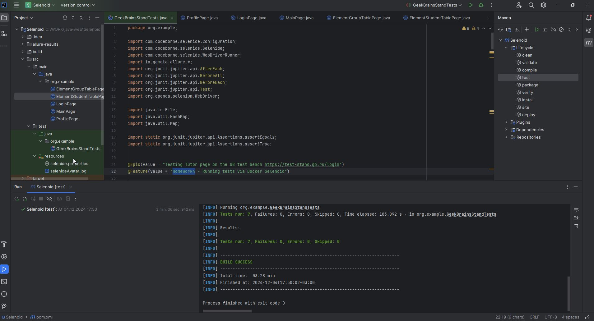

# Семинар: Selenoid
## Задание 2.
Добавить один тест на Selenide/Selenoid.
Дополнительно: добавить Allure репортинг в этот проект.

Условия для задания 2:
Написать тест на Profile Page
Логин в приложение и навигация на Profile Page
Открыть модальное окно Editing
Изменить Birthdate значение
Нажать на кнопку Save и закрыть модальное окно
Проверить, что изменения применились в поле Date of Birth в секции Additional Info

Опциональное задание:
добавить Allure репортинг в проект. В качестве решения приложить код проекта и
скриншот репорта со всеми тестами.

===========================================================================
## Test-Run проекта:

--------------------------------------------------------
